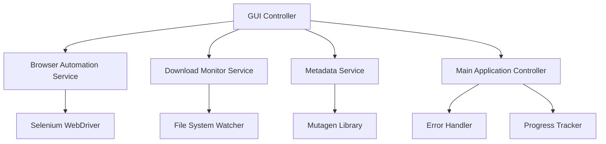

# Design Document: YouTube MP3 Downloader

## Overview

The YouTube MP3 Downloader is a Python desktop application that automates the process of downloading MP3 files from YouTube videos and applying custom metadata tags. The application uses a simple GUI built with Tkinter for user input, Selenium WebDriver for browser automation, file system monitoring for download detection, and the mutagen library for MP3 metadata manipulation.

The system follows a modular architecture with clear separation of concerns: GUI handling, browser automation, file monitoring, and metadata processing are implemented as separate components that communicate through a central controller.

## Architecture

The application follows a Model-View-Controller (MVC) pattern with additional service layers:



### Key Architectural Decisions

1. **Tkinter for GUI**: Chosen for its simplicity, built-in availability with Python, and sufficient functionality for this application's needs
2. **Selenium WebDriver**: Selected for reliable browser automation with robust element location and interaction capabilities
3. **Mutagen for Metadata**: Preferred over eyed3 for its comprehensive format support and active maintenance
4. **Service-based Architecture**: Each major function (GUI, automation, monitoring, metadata) is implemented as a separate service for maintainability and testability

## Components and Interfaces

### GUI Component (`gui_controller.py`)
- **Purpose**: Handles user interface and input validation
- **Key Methods**:
  - `create_input_form()`: Creates the main input form
  - `validate_youtube_url(url)`: Validates YouTube URL format
  - `validate_track_number(track_num)`: Validates numeric track input
  - `update_progress(message)`: Updates progress display
  - `show_error(message)`: Displays error messages
  - `show_success(file_path)`: Shows completion message

### Browser Automation Service (`browser_service.py`)
- **Purpose**: Controls web browser interactions using Selenium
- **Key Methods**:
  - `open_browser()`: Initializes Chrome WebDriver
  - `navigate_to_converter()`: Opens mp3cow.com
  - `input_youtube_url(url)`: Fills the URL input field
  - `click_convert_button()`: Clicks the conversion button
  - `wait_and_download()`: Waits and clicks download button
  - `close_browser()`: Cleans up browser resources

### Download Monitor Service (`download_monitor.py`)
- **Purpose**: Monitors Downloads folder for new MP3 files
- **Key Methods**:
  - `start_monitoring()`: Begins file system watching
  - `detect_new_mp3()`: Identifies newly downloaded MP3 files
  - `wait_for_completion(file_path)`: Ensures file is fully downloaded
  - `stop_monitoring()`: Stops file system watching

### Metadata Service (`metadata_service.py`)
- **Purpose**: Applies ID3 tags to MP3 files using mutagen
- **Key Methods**:
  - `read_metadata(file_path)`: Reads existing MP3 metadata
  - `apply_metadata(file_path, metadata_dict)`: Writes new metadata
  - `validate_mp3_file(file_path)`: Ensures file is valid MP3
  - `backup_original(file_path)`: Creates backup before modification

### Main Application Controller (`main_controller.py`)
- **Purpose**: Orchestrates the entire download and tagging process
- **Key Methods**:
  - `start_download_process(user_input)`: Main workflow orchestration
  - `handle_error(error, context)`: Centralized error handling
  - `update_progress(step, message)`: Progress tracking
  - `cleanup_resources()`: Resource cleanup on completion/error

## Data Models

### UserInput Model
```python
@dataclass
class UserInput:
    youtube_url: str
    artist: str
    title: str
    album: str
    track_number: int
    
    def validate(self) -> List[str]:
        """Returns list of validation errors"""
```

### DownloadResult Model
```python
@dataclass
class DownloadResult:
    success: bool
    file_path: Optional[str]
    error_message: Optional[str]
    download_time: datetime
```

### MetadataInfo Model
```python
@dataclass
class MetadataInfo:
    artist: str
    title: str
    album: str
    track_number: int
    original_filename: str
    
    def to_id3_dict(self) -> Dict[str, str]:
        """Converts to mutagen-compatible dictionary"""
```

## Correctness Properties

*A property is a characteristic or behavior that should hold true across all valid executions of a system-essentially, a formal statement about what the system should do. Properties serve as the bridge between human-readable specifications and machine-verifiable correctness guarantees.*

### Property 1: YouTube URL Validation
*For any* string input, the URL validation function should return true only for valid YouTube URL formats (youtube.com, youtu.be, with proper video IDs) and false for all other inputs
**Validates: Requirements 1.2**

### Property 2: Text Input Acceptance
*For any* non-empty string input, the Artist, Title, and Album fields should accept and store the input without modification
**Validates: Requirements 1.3**

### Property 3: Track Number Validation
*For any* numeric input, the track number validation should accept positive integers and reject zero, negative numbers, and non-numeric values
**Validates: Requirements 1.4**

### Property 4: Browser Navigation Sequence
*For any* valid browser session, the automation sequence (open browser → navigate to site → locate elements → interact with elements) should complete successfully when the target website is accessible
**Validates: Requirements 2.1, 2.2, 2.3, 2.4, 2.5, 2.7**

### Property 5: Timing Consistency
*For any* conversion process, the system should wait exactly 5 seconds between clicking the convert button and attempting to click the download button
**Validates: Requirements 2.6**

### Property 6: File Detection
*For any* new MP3 file appearing in the Downloads folder, the monitor should detect it within a reasonable time window and correctly identify it as the target file
**Validates: Requirements 3.1, 3.2**

### Property 7: Download Completion Verification
*For any* detected MP3 file, the system should verify the file is completely downloaded and accessible before proceeding with metadata application
**Validates: Requirements 3.3**

### Property 8: Concurrent Download Handling
*For any* scenario with multiple simultaneous downloads, the monitor should correctly identify and track the specific MP3 file related to the current conversion process
**Validates: Requirements 3.4**

### Property 9: Metadata Application
*For any* valid MP3 file and metadata input, the system should successfully apply Artist, Title, Album, and Track Number tags while preserving any existing metadata not specified by the user
**Validates: Requirements 4.1, 4.2, 4.3, 4.4, 4.5, 4.6, 4.7**

### Property 10: Invalid Input Error Handling
*For any* invalid YouTube URL input, the system should prevent submission and display an appropriate error message
**Validates: Requirements 5.1**

### Property 11: Network Error Handling
*For any* network connectivity issue or website unavailability, the system should detect the failure and provide appropriate error feedback
**Validates: Requirements 5.2**

### Property 12: Element Location Error Handling
*For any* scenario where required page elements are missing or changed, the browser controller should detect the issue and report element location errors
**Validates: Requirements 5.3**

### Property 13: Download Failure Handling
*For any* download timeout or failure scenario, the system should detect the failure and notify the user appropriately
**Validates: Requirements 5.4**

### Property 14: Metadata Error Handling
*For any* metadata application failure, the system should report the error and ensure the original file remains unchanged
**Validates: Requirements 5.5**

### Property 15: Progress Tracking
*For any* process execution, the GUI should display progress indicators at the start and update the status as each major step completes, culminating in a success message with file location
**Validates: Requirements 6.1, 6.2, 6.6**

<function_calls>
<invoke name="prework">
<parameter name="featureName">youtube-mp3-downloader

## Error Handling

The application implements comprehensive error handling across all components:

### Input Validation Errors
- **Invalid YouTube URLs**: Regex validation against known YouTube URL patterns
- **Invalid Track Numbers**: Numeric validation ensuring positive integers only
- **Empty Required Fields**: Validation ensuring all required fields have content

### Browser Automation Errors
- **Network Connectivity**: Timeout handling for page loads and navigation
- **Element Location Failures**: Robust element finding with explicit waits and fallback strategies
- **Website Changes**: Graceful handling when target website structure changes
- **Browser Crashes**: Automatic browser restart and session recovery

### File System Errors
- **Download Folder Access**: Permission checking and alternative folder fallback
- **File Lock Issues**: Retry mechanisms for files in use by other processes
- **Disk Space**: Pre-download space verification and user notification
- **File Corruption**: Integrity checking of downloaded MP3 files

### Metadata Processing Errors
- **Invalid MP3 Files**: Format validation before metadata application
- **Metadata Write Failures**: Backup creation and rollback on failure
- **Permission Issues**: Elevated permission requests when needed
- **Encoding Problems**: UTF-8 handling for international characters

### Recovery Strategies
- **Automatic Retry**: Configurable retry attempts for transient failures
- **Graceful Degradation**: Partial success handling (download without metadata)
- **User Notification**: Clear error messages with suggested actions
- **Resource Cleanup**: Proper cleanup of browser sessions and temporary files

## Testing Strategy

The application employs a dual testing approach combining unit tests for specific scenarios and property-based tests for comprehensive input coverage.

### Unit Testing Approach
Unit tests focus on specific examples, edge cases, and integration points:

- **GUI Component Tests**: Verify form creation, input validation, and user interaction handling
- **Browser Service Tests**: Test specific automation sequences with mock web pages
- **File Monitor Tests**: Verify file detection with controlled file system operations
- **Metadata Service Tests**: Test metadata reading/writing with sample MP3 files
- **Error Handling Tests**: Verify specific error scenarios and recovery mechanisms

### Property-Based Testing Configuration
Property-based tests validate universal properties across randomized inputs using the `hypothesis` library:

- **Minimum 100 iterations** per property test to ensure comprehensive coverage
- **Custom generators** for YouTube URLs, metadata strings, and file paths
- **Stateful testing** for browser automation sequences
- **Property test tags** reference design document properties

Each property test includes a comment tag in the format:
**Feature: youtube-mp3-downloader, Property {number}: {property_text}**

### Test Organization
```
tests/
├── unit/
│   ├── test_gui_controller.py
│   ├── test_browser_service.py
│   ├── test_download_monitor.py
│   ├── test_metadata_service.py
│   └── test_main_controller.py
├── property/
│   ├── test_validation_properties.py
│   ├── test_automation_properties.py
│   ├── test_file_properties.py
│   └── test_metadata_properties.py
└── integration/
    ├── test_end_to_end.py
    └── test_error_scenarios.py
```

### Testing Dependencies
- **pytest**: Test framework and runner
- **hypothesis**: Property-based testing library
- **pytest-mock**: Mocking framework for unit tests
- **selenium**: Browser automation testing
- **mutagen**: MP3 metadata testing utilities

The testing strategy ensures both concrete bug detection through unit tests and general correctness verification through property-based testing, providing comprehensive coverage of the application's behavior.